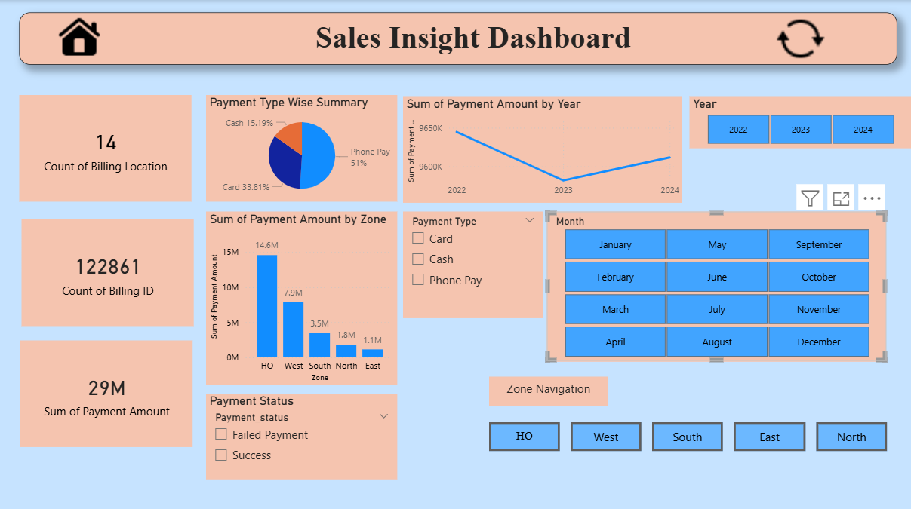
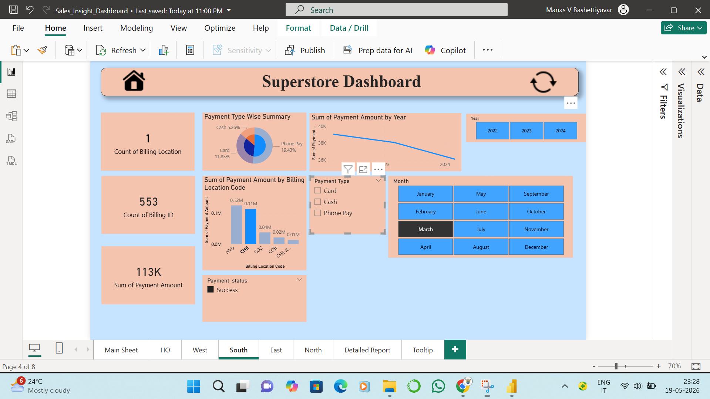
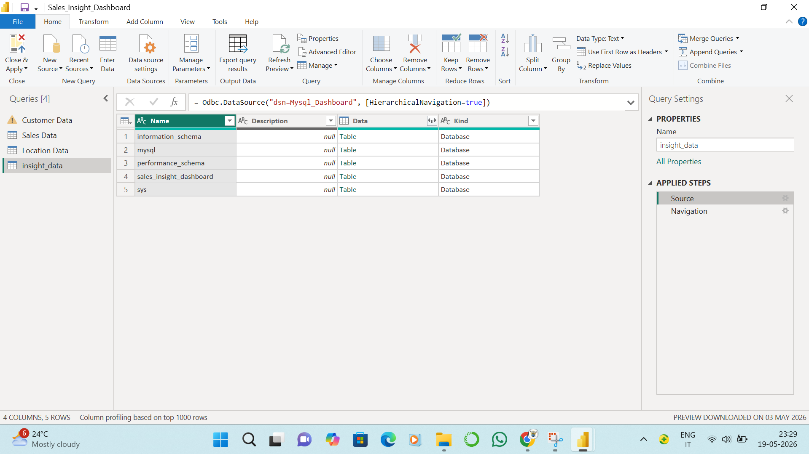

# Sales Insight Dashboard

Interactive Sales Insight Dashboard built using Power BI with MySQL integration, advanced navigation, dynamic filtering, and business analytics visualizations.

## Project Overview

This project focuses on analyzing sales performance using interactive Power BI dashboards. The dashboard provides business insights related to revenue, payment methods, billing locations, and zone-wise sales analysis through dynamic visualizations and filters.

## Features

- Interactive KPI cards and charts
- Dynamic slicers and filtering
- Zone-wise navigation pages
- Home and reset navigation buttons
- SQL database integration using ODBC
- Multi-page dashboard design
- Business analytics visualizations

## Tools & Technologies Used

- Power BI
- MySQL
- ODBC Connectivity
- Data Visualization
- Business Analytics

## Dashboard Screenshots

### Main Dashboard

### Zone Navigation

### SQL Integration

## Project Files

- `Sales_Insight_Dashboard.pbix` → Power BI project file
- Dashboard screenshots
- SQL connection proof
- Dashboard demo video

## Key Insights

- Revenue trends by year
- Payment type analysis
- Zone-wise sales comparison
- Billing location analysis
- Payment status tracking
